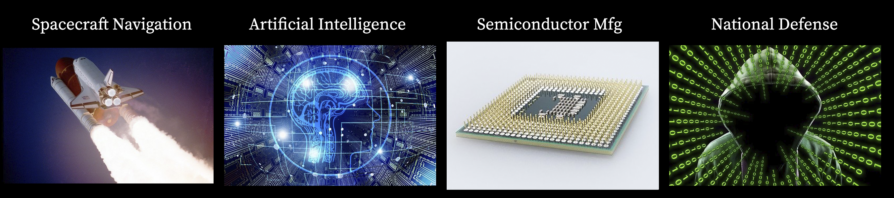
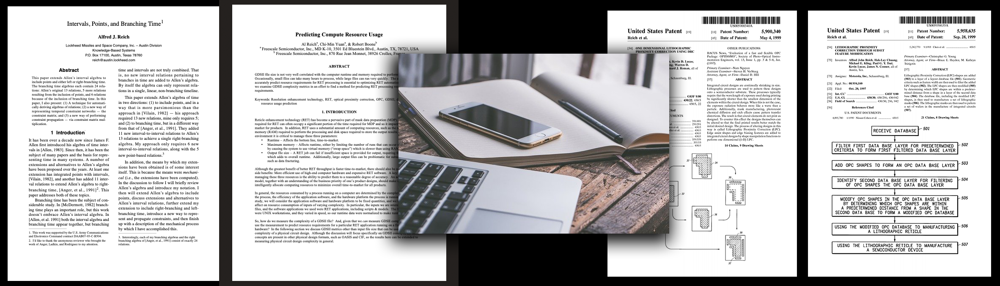

# Brief Professional Bio

I’m a retired mathematician. My area of specialty is Mathematical Statistics. I worked in industry for my entire career in the area of scientific computing, including:
* **Spacecraft Navigation** 1980-87
  * Space Shuttle Onboard & Ground Navigation
  * McDonnell Douglas Astronautics Co., Johnson Space Center, Houston, Texas
* **Artificial Intelligence** 1987-1995
  * Joint DARPA & US Army program in Artificial Intelligence
  * Automated Planning using Spatio-Temporal Reasoning
  * Lockheed Austin Division, Knowledge-Based Systems, Austin, Texas
* **Semiconductor Manufacturing** 1995-2007
  * Optical Proximity Correction (OPC) and Design for Manufacturing (DfM)
  * Motorola Semiconductor Products Sector and Freescale Semiconductor, Austin, Texas
* **National Defense** 2007-2017
  * Data Science, Data Fusion, and Cyber-Security using Machine Learning methods
  * Potomac Fusion, Inc. and Sotera Defense Solutions, Austin, Texas

## Experience & Skills

Over the course of my career, my work involved many different technologies and application domains.

Here's an abbreviated list: Anomaly Detection, Artificial Intelligence (AI), Astrodynamics, Automated Reasoning, Bayesian Data Analysis (BDA), Bayesian Networks, Classical Statistical Methods, Computational Geometry, Computer Programming, Cyber-Security, Data Fusion, Data Science, Expert Systems, Machine Learning, Mathematical Models, Network Analysis, Numerical Methods, Optical Proximity Correction (OPC), Orbit Determination, Phase Shift Masks (PSM), Physical Semiconductor Design Formats (GDSII, OASIS), Semantic Web Technologies (RDF, OWL), Software Engineering, Spacecraft Navigation, Spatio-Temporal Reasoning, Statistical Models, Technical Writing, and Uncertainty Reasoning.

More on my work and educational history can be found on [my LinkedIn profile](https://www.linkedin.com/in/alreich/).

## Publications & Patents

A list of my papers and patents can be found at [Google Scholar](https://scholar.google.com/citations?user=N_wnSyUAAAAJ&hl=en).
(Here's a [PDF version](Google_Scholar_AJR.pdf), in case the link doesn't work.)

## Mathematical & Statistical Topics

[Here are a few Jupyter Notebooks](jupyter_notebooks.md) that I've written on various topics in mathematical and statistical computing:

* Bayesian Beta-Binomial Example -- An example of Bayesian parameter estimation
* Covid-19 and Blood Types (using a Bayesian approach) -- An alternative approach to a 2020 paper in medRxiv
* Extreme Value Theory (EVT) Example -- EVT is used to analyze rare events
* Monoids 101 for Apache Spark -- Tutorial on large scale, distributed computing

Python APIs (experimental):
* Qualitative Reasoning:  Spatio-Temporal Reasoning using Relation Algebras and Constraint Networks. [github](https://github.com/alreich/qualreas)
* Abstract Algebra - Finite Algebras in Python (Groups, Rings, Fields, Vector Spaces, Modules, Monoids, Semigroups, and Magmas) [documentation](https://abstract-algebra.readthedocs.io/en/latest/index.html) and [source code](https://github.com/alreich/abstract_algebra)

## Education

Texas Tech University, Ph.D., Mathematics (Mathematical Statistics), 1980.

Dissertation: "Robust and adaptive estimation of location and scale"

Citable Link: http://hdl.handle.net/2346/16490

University of Utah, B.A. & M.A., Mathematics, 1973 & 1975.

## Hobbies

I'm an avid photographer. Many of my photos can be seen at [Flickr](https://www.flickr.com/photos/alreich).

I also enjoy drawing and painting. Some of my recent work can be found on [Instagram](https://www.instagram.com/al.reich/)
