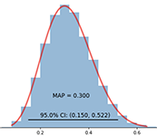
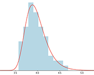

# Brief Professional Bio

I’m a retired mathematician. My area of specialty is Mathematical Statistics. I worked in industry for my entire career in the area of scientific computing, including:
* Spacecraft Navigation 1980-87 (e.g., Space Shuttle Onboard & Ground Navigation)
* Artificial Intelligence 1987-1995 (e.g., Automated Planning, Spatio-Temporal Reasoning)
* Semiconductor Manufacturing 1995-2007 (e.g., Optical Proximity Correction, Design for Manufacturing)
* National Defense (2007-2017) (e.g., Data Science, Machine Learning, Cyber-Security)

Over the course of my career, my work involved different technologies and application domains, such as, Anomaly Detection, Army Command & Control, Astrodynamics, Automated Reasoning, Bayesian Data Analysis, Bayesian Networks, Classical Statistical Methods, Computational Geometry, Computer Programming, Data Science, Design for Manufacturing, Design Rule Checking, Expert Systems, Formal Logic, Functional Programming, Logic Programming, Machine Learning, Mathematical Models, Network Analysis, Numerical Methods, Object-Oriented Programming, Optical Proximity Correction, Orbit Determination, Phase Shift Masks, Physical Semiconductor Design Formats (GDSII, OASIS), Proposal Writing, Semantic Web Technologies, Spacecraft Navigation, Spatio-Temporal Reasoning, Statistical Models, and Technical Writing.

Much of my work involved computer programming using over a dozen different programming languages, including Python, R, Apache Spark, Java, Matlab, SQL, Scheme, Common Lisp, Prolog, C++, C, and Fortran.

## My Publications & Patents

A list of my papers and patents can be found at [Google Scholar](https://scholar.google.com/citations?user=N_wnSyUAAAAJ&hl=en).
(Here's a [PDF version](Google_Scholar_AJR.pdf), in case the link doesn't work.)

## Mathematical & Statistical Topics

[This link](jupyter_notebooks.md) will take you to a few Jupyter Notebooks that I've written on various topics in mathematical and statistical computing:

* Bayesian Beta-Binomial Example -- An example of Bayesian parameter estimation
* Covid-19 and Blood Types (using a Bayesian approach) -- An alternative approach to a recent paper
* Extreme Value Theory (EVT) Example -- EVT is used to analyze rare events
* Monoids 101 for Apache Spark -- Tutorial on large scale, distributed computing

{: .align-left}
Something about Bayes Theorem
{:style="clear: left"}

{: .align-left}
Something about EVT
{:style="clear: left"}

## My Hobbies

I'm an avid photographer. Many of my photos can be seen at [Flickr](https://www.flickr.com/photos/alreich).

I'm also love to draw and paint. Some of my recent works can be found on [Instagram](https://www.instagram.com/al.reich/)

